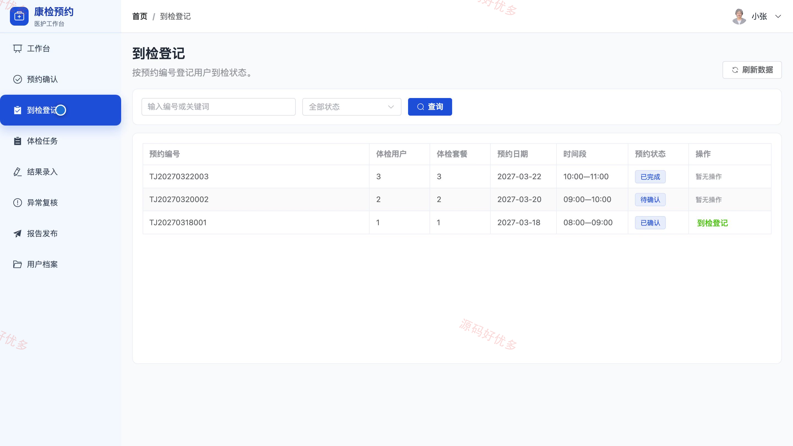
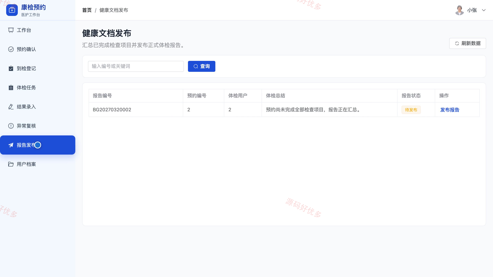
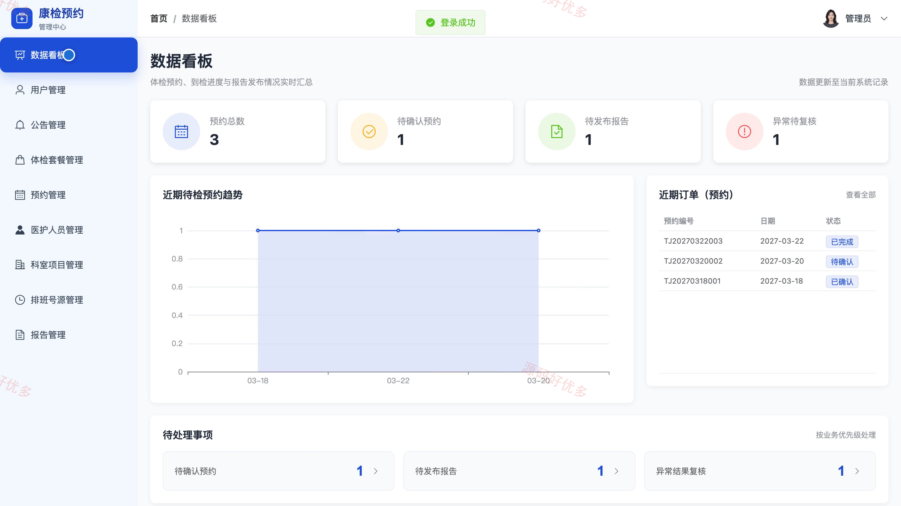
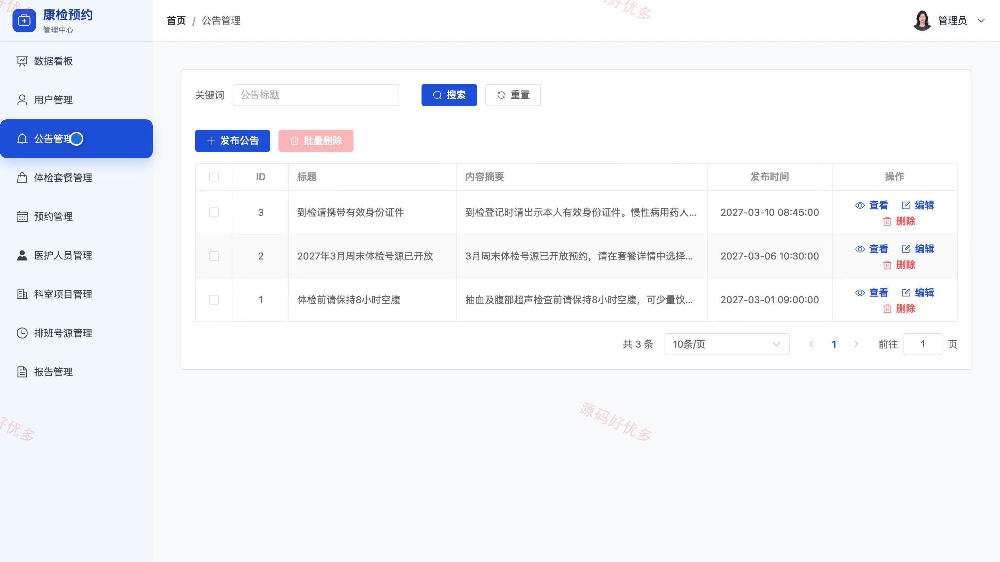

## 源码问题查看主页咨询

### 一、关键词
医院体检预约、健康体检、体检套餐、到检登记、体检报告

### 二、作品包含
源码+数据库+全套环境和工具资源+本地部署教程

### 三、项目技术
前端技术： Html、Css、Js、Vue3.4、Element-Plus
后端技术：Java、SpringBoot3.2.0、MyBatis-Plus

### 四、运行环境（以下版本亲测，其他版本兼容性请自行测试）
开发工具：IDEA/eclipse + VSCODE

数据库：MySQL5.7+（共14张表）

数据库管理工具：Navicat10以上版本

环境配置软件： JDK17 + Maven

前端Nodejs：16+

浏览器：谷歌浏览器

### 五、项目介绍
项目编号：bs059A

系统面向体检用户、医护人员和系统管理员，覆盖体检套餐浏览与预约、到检登记、检查结果录入、异常复核、健康文档发布以及排班号源和基础资料维护等业务。

角色：体检用户、体检医护人员、系统管理员

体检用户功能：体检套餐浏览、套餐详情查看、体检预约、预约记录管理、体检报告查看、健康档案查看、体检须知、个人资料管理。

体检医护人员功能：预约确认、到检登记、体检任务管理、体检结果录入、异常结果复核、健康文档发布、用户档案管理。

系统管理员功能：数据看板、用户管理、公告管理、体检套餐管理、预约管理、医护人员管理、科室项目管理、排班号源管理。

### 六、运行截图

